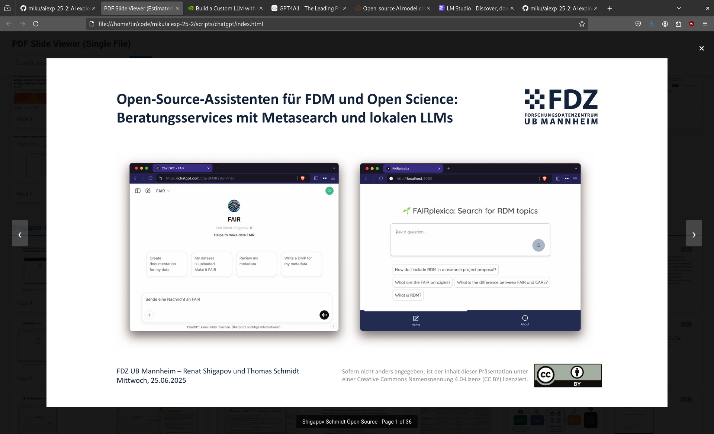

# Libraries and AI (7/2025)

> 2025-07-17, 13:00, Martin Czygan -- UBL KI MEETUP #4, Applications / "Document Chat" / [BIDC](https://2025.bid-kongress.de/) review

## Summaries

* Navigating AI ...
* Bibliothekskongress 2025 / AI TRACK, [https://pdf-program.abstractserver.com/?congress=bid2025](https://pdf-program.abstractserver.com/?congress=bid2025)

## Demos

### Chat with your local documents (PDF)

#### Requirements

* [ ] a desktop application to interact with LLM
* [ ] either a GPU or an API to access a remote model (available through GWDG, Leibniz, etc.)

#### Options

Numerous applications to run chat with your documents locally:

* [x] [GPT4ALL](https://www.nomic.ai/gpt4all) ([$17M](https://www.reuters.com/technology/open-source-ai-model-creator-nomic-raises-17-million-led-by-coatue-2023-07-13/), ...)
* [x] [ChatRTX](https://www.nvidia.com/en-us/ai-on-rtx/chatrtx/)
* [x] [AnythingLLM](https://anythingllm.com/desktop), [GitHub](https://github.com/Mintplex-Labs/anything-llm)
* [x] [LMStudio](https://lmstudio.ai/)
* ...

```
$ ./gpt4all/bin/chat
```

Index and embed a folder of PDFs.


Start dialogue.


## BID CONGRESS 2025 Review

### Ideation

[](https://opus4.kobv.de/opus4-bib-info/files/19805/Stricker_Digitale_Editionen.pdf)

### Beratung (FAIR)

[](https://opus4.kobv.de/opus4-bib-info/files/19765/Shigapov-Schmidt-Open-Source.pdf)

* conventient, fast
* dependent of third party infra

### KI Schulungen

[](https://opus4.kobv.de/opus4-bib-info/files/19492/Respekt-wers-selber-macht_HandsOn_2025.pdf)

* dynamische Entwicklung


### Future

[](https://opus4.kobv.de/opus4-bib-info/files/19530/Snapshots.pdf)

[](https://opus4.kobv.de/opus4-bib-info/files/19530/Snapshots.pdf)

* does GLAM not have enough images?

### AI at a small social science university

[](https://opus4.kobv.de/opus4-bib-info/files/19804/Presentation_AI_at_the_Hertie_School.pdf)


### Survey

[](https://opus4.kobv.de/opus4-bib-info/files/19711/MIKS_UmfrageV3-OPUS.pdf)

### OER

[](https://opus4.kobv.de/opus4-bib-info/files/19793/OER_Waldschmidt_Dietz_a.pdf)

### YAAK - Yet another Arbeitskreis

[](https://opus4.kobv.de/opus4-bib-info/files/19821/Renner_Bremen_2025_KI.pdf)


### Writing Project

[](https://opus4.kobv.de/opus4-bib-info/files/19712/KI_Kompetenzen.pdf)

### EDU

[](https://opus4.kobv.de/opus4-bib-info/files/19770/Klatt_BiblioCon_20250619.pdf)

### Responsible Use

[](https://opus4.kobv.de/opus4-bib-info/files/19841/Folien_fuer_Veroeffentlichung_Kasprzik.pdf)


### DNBLab

[](https://opus4.kobv.de/opus4-bib-info/files/19497/DNBLab_KI_20250625.pdf)

### Service Chatbot

[](https://opus4.kobv.de/opus4-bib-info/files/19795/BibKI_BiblioCon.pdf)

### Grepping "KI"

* [ripgrep-all](https://github.com/phiresky/ripgrep-all) "KI"


## WIP demos

### Chat/Search over a FT (wip)

> Exploring a set of 22K docs and 500K pages with the help of AI

What can the machine learn from this corpus?

* let's cluster it into 2, 3, ..., 10 categories, what do we get?
* let's embed the documents into a vector database and see which records are similar
* let's embed paragraphs and see which documents are similar

Matching queries against documents.

* full text search
* natural language query; LLM and RAG
* natural language query to document query; fuzzy text, but exact query
* query in images

You can do this with any document set.

### MCP server for catalogs (wip)

* expose a library catalog to a (local) chat interface
* make it so that we can find books, text, new items, but also images, digitized pages, and more (similarity search)

## References

* [](https://discovery.ucl.ac.uk/id/eprint/10209236/1/Navigating-Artificial-Intelligence-for-Cultural-Heritage-Organisations.pdf)

